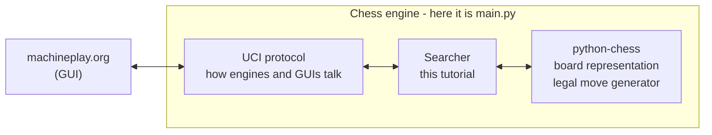
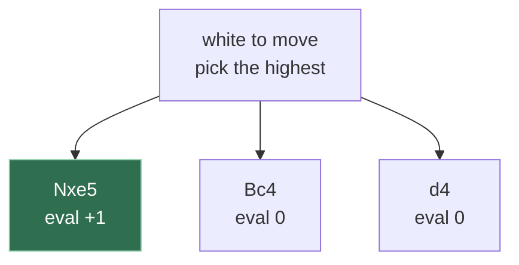
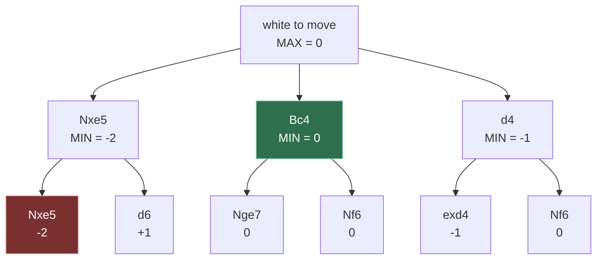

# Welcome

This is tutorial on building simple chess engine in python and uploading it to machineplay.org.

For that we are using existing chess library (python-chess) that already has chess board representation,
legal moves generator and all chess rules, while machineplay is our UI, it helps us see chessboard, games and
start tournaments, it also has library of other chess engines.

With all of that, we aren't actually building whole chess engine from scratch, we are doing what you could call
AI part of chess engine or best move searcher. The whole thing takes 30 minutes of your time and might play
chess better than you.

Here is some context



Prerequisites
- Basic Python programming skills (ifs, loops, recursion)
- General programmer tools: text editor, git, github, docker installed
- Knowing what chess is


# Fork and upload

Fork starter code to your github account
https://github.com/MachinePlay/python-chess-starter/fork

Git clone it
```
git clone <your-link>
```

Register on machineplay.org
https://machineplay.org


Build and upload
```
machineplay login
machineplay upload
```

Now you can see first version of chess engine uploaded in your account.
Try to make it play one game against itself.
You can start it from starting page of machineplay.org or with cli [TODO: cli cannot start games yet]

```
machineplay game --white your-engine --black your-engine
```

# Understanding starter code

Look around, there is many boring files like README, pyproject.toml, uv.lock, LICENSE that doesn't need explanation.

There is also Dockerfile that setup python3.13, copies source code and makes image of your engine to then upload it on machineplay.
It also means that python is not the only programming language you can use, you can actually use any language as long as you
can pack in Dockerfile, like js, C++, Rust, heck you can do this with weirder things like Haskell or assembler if you wish

But the main file is of course main.py
Let's look at it piece by piece

first function

```python
import sys
import chess

def uci() -> None:
    board = chess.Board()

    while True:
        line = sys.stdin.readline()
        if not line:  # stdin closed
            break
        command = line.strip()

        if command == "uci":
            print("id name python-chess-starter")
            print("id author your-name-here")
            print("uciok")
        elif command == "isready":
            print("readyok")
        elif command == "ucinewgame":
            board.reset()
        elif command.startswith("position"):
            board = parse_position(command)
        elif command.startswith("go"):
            move = choose_move(board)
            print(f"bestmove {move.uci()}")
        elif command == "quit":
            break

        sys.stdout.flush()
```

Look chess engine is just interpreter, it has REPL read eval print loop, like the python itself.

The only state you have between commands is `chess.Board()` on top that contains 64 squares and pieces on them.
You might want to peek into external dependency we use, [python-chess](https://python-chess.readthedocs.io/en/latest/), but this tutorial
will introduce needed methods when they needed to complete tasks.
Here is preview though: Board has many useful methods like `legal_moves`, `push`/`pop` moves on current board, check if game ended with checkmate `is_checkmate()`.

Note:
You might imagine `chess` contains a lot of code already and using it is `cheating`. We are taking this shortcut to make tutorial shorter. But you can always
implement `chess`, low level foundation of every chess engine yourself. Data structure used inside of this project is called `bitboards` and it is not the only way to
do chess board representation. If you want to know more [Board Representation](https://chessprogramming.org/Board_Representation)

`while True` opens infinite loop, in which you communicate in stdin, stdin is usual print/input, but here it is
slightly more fancy with `sys.stdin.readline` and `sys.stdout.flush`, this avoids buffering, so chess engine responds with
moves immediately, very important in fast chess with tight time controls

then you have commands
- uci - chess engine introduces itself to the driving program (you, machineplay or other GUI program that speaks UCI), feel free to name engine as you want and put your author name
- isready - healtcheck to you engine, (isready/readyok) is (ping/pong) or (hi how are you / i am fine) of UCI
- ucinewgame - new game started, forget current board
- position - driving program communicates how current position looks like, it will include moves from your opponent player, look at `parse_position` yourself, it is still simple string parsing
- go - main command you need implement, here your engine thinks and replies with bestmove it found
- quit - quit


used in UCI `position`, function `parse_position` takes strings like `position startpos` or `position startpos moves e2e4 e7e5`, parses them, they are just strings
at the end of the day. And then returns updated board state by starting with default board `chess.Board()` and pushing moves on it with `board.push_uci`, here `_uci`
is moves in UCI moves format, `e2e4` means piece goes from `e2` to `e4`

```python
def parse_position(command: str) -> chess.Board:
    """Build a board from a UCI ``position`` command.

    Handles the two forms the protocol allows:

        position startpos
        position startpos moves e2e4 e7e5
    """
    tokens = command.split()

    if tokens[1] == "startpos":
        board = chess.Board()
        moves_index = 2
    else:
        raise ValueError("Only `startpos` implemented")

    if len(tokens) > moves_index and tokens[moves_index] == "moves":
        for uci in tokens[moves_index + 1 :]:
            board.push_uci(uci)

    return board
```

Central function is `choose_move`. That is the place where engine thinks and where you will write code

```python
def choose_move(board: chess.Board) -> chess.Move:
    for move in board.legal_moves:
        return move  # Just return first move

    raise ValueError("Only called on boards with at least one legal move")
```

Here it just returns first legal move in given position.
For example starting position has 20 legal moves

```python
>>> [move.uci() for move in list(chess.Board().legal_moves)]
['g1h3', 'g1f3', 'b1c3', 'b1a3', 'h2h3', 'g2g3', 'f2f3', 'e2e3', 'd2d3', 'c2c3', 'b2b3', 'a2a3', 'h2h4', 'g2g4', 'f2f4', 'e2e4', 'd2d4', 'c2c4', 'b2b4', 'a2a4']
```

In this case engine will always respond with `g1h3` in starting position.

Now when you saw all code, try to run it locally
python in this project setup with `uv`
[TODO uv install]

Run engine

```bash
uv run python main.py
```

ask his name or if it is ready or what it thinks best move is in starting position and bye

<details>
<summary>Typical UCI session</summary>

Just type `uci`, `isready`, `go`, `quit`

```bash
$ uv run python main.py
uci
id name python-chess-starter
id author your-name-here
uciok
isready
readyok
go
bestmove g1h3
quit
```

</details>


# Random Mover

As you might notice engine replies with same moves each time. You can start new game again on machineplay.
Or run locally `uv run python main.py`.
And ask `go` several times.

Your first task is to make it respond with random moves instead. It doesn't improves strength of the engine. But it setups
loop in which you will program engine. Edit `main.py`, `machineplay upload`, `machineplay game`


<details>
<summary>Random mover solution</summary>

Put this code in right places of main.py

```python
import random

def choose_move(board: chess.Board) -> chess.Move:
    moves = list(board.legal_moves)
    return random.choice(moves)
```

full solution in solutions/random_mover.py

</details>

I hope you saw fascinating long game (played in few seconds), probably at move 200 only kings left and game ended in draw.
But you get different result each time!

# Depth 1

Now make engine think in one move deep and choosing move with highest material. In chess terms material is sum of your pieces,
your pieces have "cost"

Piece type
- King infinite
- Queen 9
- Rook 5
- Bishop 3
- Knight 3
- Pawn 1

So score is sum of your pieces - sum of opponent pieces
In most cases player that has better score is winning, so we want to choose move that maximizes our score.

Thinking one move deep means: try every legal move, score the position it leads to, keep the best one.
Here are three of the 30 legal moves after `1.e4 e5 2.Nf3 Nc6`



Nxe5 takes a pawn, so it scores +1 while the quiet moves score 0. The engine plays it.
Whether that is a *good* idea is the subject of the next chapter.

Task:
You want to add extra function named `evaluate` that calculates score of given position.
Then choose move that maximizes score, just one level deep, try all moves for given position and choose
one with maximum score

Your `evaluate` function must return score from white perspective, but your engine can play for both
perspetives for white and for black. You might think that white is maximizing and black is minimazing (if score is given from white perspective),
and so in `choose_move` you need to flip comparison `>`/`<` (more than/less than). This one way to do that, better way that will play nicely with
next chapters is to introduce new variable `side2move` that is +1 for white turn or -1 for black turn and multiply score with this variable, so you
are always maximazing

Chess APIs you will need:
- board.turn, True if white to move, else False
- chess.SQUARES, contains index of 64 squares
- board.piece_at(square), gives piece or None at asked square, piece has `piece.color` (chess.WHITE or chess.BLACK) and `piece.piece_type` on of
  (chess.KING, chess.QUEEN, chess.ROOK, chess.BISHOP, chess.KNIGHT, chess.PAWN)
- board.legal_moves used with `board.push` and `board.pop`


<details>
<summary>Depth 1 solution</summary>

Put this code in right places of main.py

```python
def choose_move(board: chess.Board) -> chess.Move:
    side2play = 1 if board.turn else -1

    best_move = None
    best_score = -math.inf

    for move in board.legal_moves:
        board.push(move)
        score = side2play * evaluate(board)
        board.pop()

        if score > best_score:
            best_score = score
            best_move = move

    if best_move is None:
        raise ValueError("choose_move is called on board without legal moves")

    return best_move


COST_BY_PIECE_TYPE = {
    chess.KING: 99,
    chess.QUEEN: 9,
    chess.ROOK: 5,
    chess.BISHOP: 3,
    chess.KNIGHT: 3,
    chess.PAWN: 1,
}


def evaluate(board: chess.Board) -> int:
    white_score = 0
    black_score = 0

    for square in chess.SQUARES:
        if piece := board.piece_at(square):
            if piece.color == chess.WHITE:
                white_score += COST_BY_PIECE_TYPE[piece.piece_type]
            else:
                black_score += COST_BY_PIECE_TYPE[piece.piece_type]

    return white_score - black_score
```

full solution in solutions/depth1.py

</details>

This version produces games very similar to initial version after fork (first legal move), because score
with depth 1 is usually same for each possible move. But important distinction is that it will take piece
if it can, e.g. it will happily take pawn with queen if it can, no matter if queen is lost after that take.
In game with solution/depth1.py you will see that knight takes pawn when it can and then it takes bishop
and difference with (first legal move) version is that knights get taken by rook after that


TODO: stuff below

# Minimax

Generalized depth 1: same loop, but recursive. Still branching on `board.turn`.
Checkmate and stalemate have to be scored here. Solution: `solutions/minimax.py`

Same position and the same three moves as the Depth 1 diagram, except now black gets to answer



White wants the highest number, black wants the lowest, so each player picks their own way
at their own level. The pawn grab from the last chapter is refuted: black simply takes back,
which makes Nxe5 worth -2 instead of +1, and the quiet Bc4 wins by not losing anything.

# Negamax

Score from the point of view of the side to move, and the two branches collapse into one.
Solution: `solutions/negamax.py`

# Alphabeta

Solution: `solutions/alphabeta.py`

# Iterative deepening

Ask user to parse `go` with time and make chess engine limited by time.
Solution: `solutions/iterative_deepening.py`

# Little improvements

Mobility (available number of moves in position)
Piece Square tables (yeah)

# What to do next

star starter template, suggest this tutorial to friends. Implement better evaluation/search (link to chess programming wiki). Try to beat
other engines on machineplay, go up in leaderboard. Give your engine proper name / description on github/machineplay engine page.
Write your own tutorials. Evaluate chessboards with neural networks. Port your engine to faster programming language. Implement board respresentation from scratch

